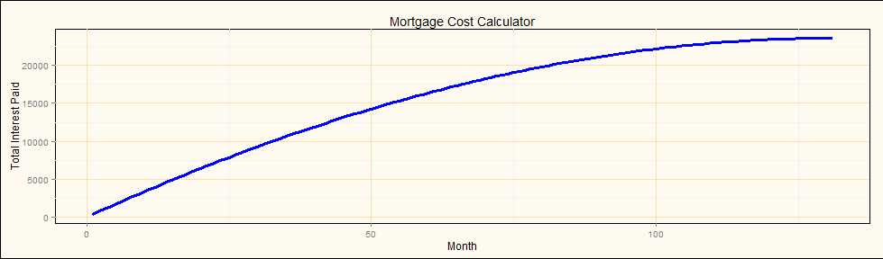

---
title       : XSMC
subtitle    : The eXtremely Simple Mortgage Calculator
author      : SDMitchell
job         : 
framework   : io2012        # {io2012, html5slides, shower, dzslides, ...}
highlighter : highlight.js  # {highlight.js, prettify, highlight}
hitheme     : tomorrow      # 
widgets     : [mathjax]            # {mathjax, quiz, bootstrap}
mode        : selfcontained # {standalone, draft}
knit        : slidify::knit2slides
--- .class #id bg:url(StockPhoto-HousePercent.jpg)

<style>
.title-slide {
  background-color: #F08080;
}
</style>


## Welcome to the XSMC!

When looking at a mortgage, it is always important to not only know if you can afford the month-to-month payments, but also to realize just how much the mortgage will cost you in interest over the entirety of the loan. Should I make a bigger downpayment? Will I accumulate more wealth if I invest a portion in the stock markets instead of using my liquid assets as a downpayment? Should I keep renting until I can accumulate a larger downpayment?
  
The first step to all of this is to compute the amount of interest you will be paying over the lifetime of your mortgage and the XSMC application is here to help.

--- .class #id bg:url(StockPhoto-HousePercent.jpg)

## Some Mathematics

Nobody promised there wouldn't be math - where did you get that idea? What we are promising is to do that math FOR you. Let's take a look at how many payments you'll need to make if you already know your monthly budget; here is the formula:

$$\frac{log(M) - log(M - \frac{P * I}{12})}{log(1 + \frac{I}{12})}$$

Where  
	M - The monthly payment you are willing to pay  
	I - The annual interest rate of the loan (as a decimal)  
	P - The original amount to be borrowed (the principal)  

Too. Much. Math. This is where XSMC comes into play - you give us the numbers and we can figure all of this out for you!

--- .class #id bg:url(StockPhoto-HousePercent.jpg)

## Even Worse - Some Code

Here is a bit of the secret sauce - what makes XMBC tick. But not too much as we only have so much room here!


```r
yourMonthlyPayment <- 1400
yourInterestRate <- 2.59
yourPrincipal <- 159000
payments <- NumberOfPeriodsRemaining(yourMonthlyPayment, yourInterestRate, yourPrincipal)
interestPaid <- InterestPaid(yourMonthlyPayment, yourInterestRate, yourPrincipal, payments)
```

So after crunching through a few formulas like the one we looked at earlier, we can see that in our example the number of months needed to pay this mortgage would be 131 months and in total we would wind up paying $23599.16 in interest. Too easy!

--- .class #id bg:url(StockPhoto-HousePercent.jpg)

## Pictures!

Numbers are all well and good and we need to know them, but sometimes a picture is worth a thousand words. Since we're running out of space for those thousand words, let's finish off with a plot of just how much interest you would be paying over time for the previous example. XSMC does this interactively with slider controls so you can do this all very easily to evaluate your options:
  
 
  
And there you have it - all the news (good or bad) around the interest you'll be paying for that fabulous home. Good Luck!


